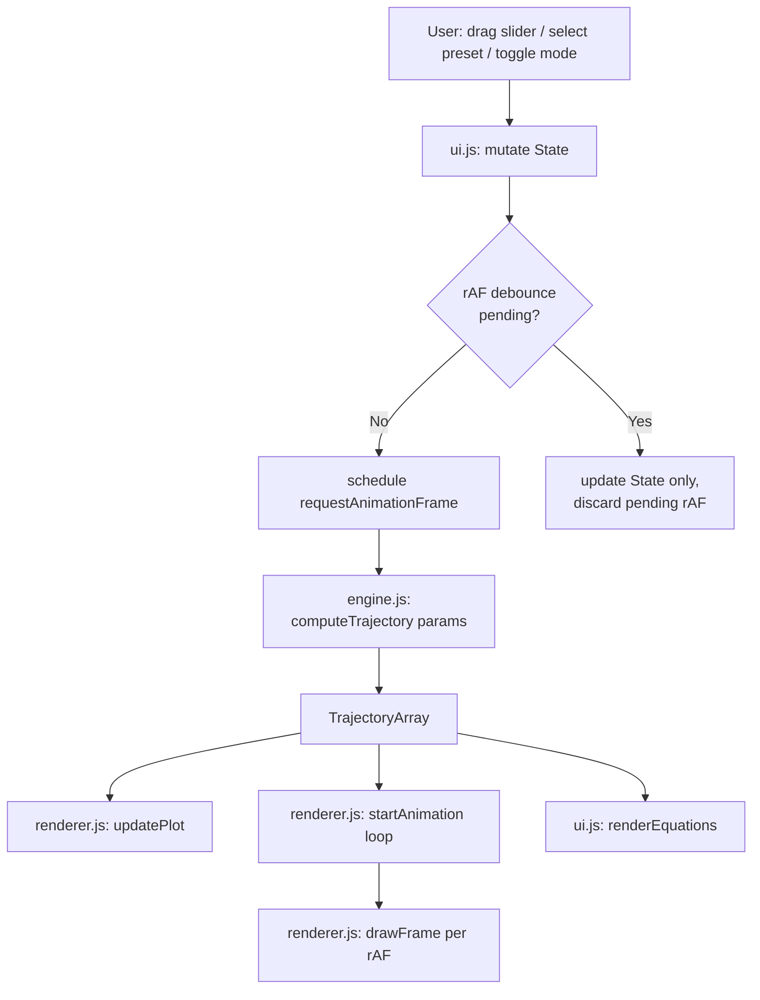

# Design Document — Projectile Physics Sandbox

## Overview

The Projectile Physics Sandbox is a browser-based educational simulation hosted as a static site on GitHub Pages. It replaces the existing placeholder skeleton with a fully interactive application where users explore projectile motion by adjusting parameters via sliders and immediately seeing the effects on a live canvas animation, a Chart.js trajectory plot, and a KaTeX equation dashboard.

**Technology stack:**
- Vanilla JavaScript ES6 modules (no build step, no bundler, no framework)
- TailwindCSS via CDN — layout and theming
- Chart.js via CDN — trajectory plot
- KaTeX via CDN — equation rendering
- HTML5 Canvas API — real-time animation
- Hosted on GitHub Pages (static, no server-side logic)

**Design goals:**
1. Keep each concern isolated in its own module (`engine.js`, `ui.js`, `renderer.js`)
2. Maintain a unidirectional data flow: State → Engine → Renderer
3. Preserve sub-50 ms computation and sub-100 ms UI update latency
4. Allow full URL-based state sharing without a backend

---

## Architecture

### Module Dependency Graph

```
index.html
    └── <script type="module" src="ui.js">
            ├── import engine.js
            └── import renderer.js
```

`engine.js` and `renderer.js` have no mutual dependency and no DOM access.

### Unidirectional Data Flow

```
User Input (slider/select/toggle)
        │
        ▼
   ui.js: State update
        │
        ▼ (rAF-gated, one per frame)
   engine.js: computeTrajectory(params) → TrajectoryArray
        │
        ├──▶ renderer.js: updatePlot(chart, trajectoryData)
        ├──▶ renderer.js: begin animation loop → drawFrame(ctx, point, trail)
        └──▶ ui.js: renderEquations(state, trajectoryStats)
```



---

## Components and Interfaces

### engine.js

**Exports:**

```js
/**
 * Compute the full trajectory from launch until ground impact.
 * @param {PhysicsParams} params
 * @returns {StateObject[]}  Array of simulation states; empty if launch is invalid.
 */
export function computeTrajectory(params) { … }

/**
 * Advance simulation by one Euler step.
 * @param {StateObject} state  Current simulation state
 * @param {PhysicsParams} params
 * @returns {StateObject}  Next state
 */
export function eulerStep(state, params) { … }
```

**PhysicsParams type:**
```js
{
  angle:    number,  // degrees [0, 90]
  speed:    number,  // m/s    [1, 2000]
  mass:     number,  // kg     [0.001, 50.0]
  diameter: number,  // m      [0.005, 0.5]
  cd:       number,  // —      [0.05, 1.0]
  rho:      number,  // kg/m³  [0.0, 1.5]
  gravity:  number,  // m/s²   [0.1, 25.0]
  dt:       number,  // s      [0.0001, 0.005] (default 0.001)
}
```

**StateObject type:**
```js
{
  t:     number,  // simulation time (s)
  x:     number,  // horizontal position (m)
  y:     number,  // altitude (m)
  vx:    number,  // horizontal velocity (m/s)
  vy:    number,  // vertical velocity (m/s)
  speed: number,  // total speed √(vx²+vy²) (m/s)
}
```

### ui.js

**Exports:**

```js
/**
 * Returns a frozen snapshot of the current State.
 * @returns {SimState}
 */
export function getState() { … }

/**
 * Register a callback invoked each time State changes.
 * @param {(state: SimState) => void} listener
 * @returns {() => void}  Unsubscribe function
 */
export function onStateChange(listener) { … }
```

**SimState type:**
```js
{
  angle:    number,
  speed:    number,
  mass:     number,
  diameter: number,
  cd:       number,
  rho:      number,  // 0.0 = Vacuum, 1.225 = Realistic
  gravity:  number,
  mode:     'vacuum' | 'realistic',
  preset:   string | null,  // preset key or null
}
```

**Internal functions (not exported):**

```js
function initState()                        // build default SimState
function handleSliderInput(event)           // update State, schedule rAF
function handlePresetSelect(event)          // bulk-update State from preset table
function scheduleUpdate()                   // rAF-gated debounce trigger
function runUpdateCycle()                   // rAF callback: compute + render + equations
function renderEquations(state, stats)      // KaTeX rendering
function serializeState(state)             // → URLSearchParams string
function parseQueryString(qs)             // → Partial<SimState> with validation
function applyURLState(partial)           // merge parsed URL state into State
```

### renderer.js

**Exports:**

```js
/**
 * Draw one animation frame on the canvas.
 * @param {CanvasRenderingContext2D} ctx
 * @param {StateObject} point        Current projectile position
 * @param {StateObject[]} trail      Last ≤200 positions (oldest first)
 * @param {CanvasScaleInfo} scaleInfo  Coordinate transform
 * @param {string} category          'sports'|'firearms'|'ordnance'|null
 * @param {boolean} showLanding      Whether to render landing overlay
 * @param {number} range             Total range in metres (for overlay)
 */
export function drawFrame(ctx, point, trail, scaleInfo, category, showLanding, range) { … }

/**
 * Refresh Chart.js dataset with new trajectory data.
 * @param {Chart} chart
 * @param {StateObject[]} trajectoryData
 * @param {'vacuum'|'realistic'} mode
 * @param {boolean} compareMode        True when both datasets should be shown
 */
export function updatePlot(chart, trajectoryData, mode, compareMode) { … }

/**
 * Compute coordinate-transform info from a trajectory and canvas dimensions.
 * @param {StateObject[]} trajectory
 * @param {number} canvasW
 * @param {number} canvasH
 * @returns {CanvasScaleInfo}
 */
export function computeScaleInfo(trajectory, canvasW, canvasH) { … }
```

**CanvasScaleInfo type:**
```js
{
  scaleX:  number,  // pixels per metre (horizontal)
  scaleY:  number,  // pixels per metre (vertical, inverted)
  offsetX: number,  // left padding (pixels)
  offsetY: number,  // bottom padding (pixels)
  maxX:    number,  // maximum x extent (m)
  maxY:    number,  // maximum y extent (m)
}
```

---

## Data Models

### Preset Table

Stored as a constant in `ui.js`:

```js
const PRESETS = {
  // Sports
  'golf-ball':   { mass: 0.0459, diameter: 0.0427, cd: 0.47, category: 'sports' },
  'basketball':  { mass: 0.6200, diameter: 0.2400, cd: 0.47, category: 'sports' },
  'baseball':    { mass: 0.1450, diameter: 0.0737, cd: 0.35, category: 'sports' },
  'ping-pong':   { mass: 0.0027, diameter: 0.0400, cd: 0.40, category: 'sports' },
  // Firearms
  '22-lr':       { mass: 0.0024, diameter: 0.0056, cd: 0.17, category: 'firearms' },
  '556-nato':    { mass: 0.0040, diameter: 0.0057, cd: 0.30, category: 'firearms' },
  '45-acp':      { mass: 0.0148, diameter: 0.0115, cd: 0.20, category: 'firearms' },
  // Ordnance
  '60mm-mortar': { mass: 1.3300, diameter: 0.0600, cd: 0.30, category: 'ordnance' },
  'cannonball':  { mass: 5.4400, diameter: 0.1100, cd: 0.47, category: 'ordnance' },
  'atm':         { mass: 10.500, diameter: 0.0800, cd: 0.20, category: 'ordnance' },
};
```

### URL Serialization Schema

Seven numeric keys + one string key:

| Key       | Type   | Valid range       | Default |
|-----------|--------|-------------------|---------|
| `angle`   | float  | [0, 90]           | 45      |
| `speed`   | float  | [1, 2000]         | 50      |
| `mass`    | float  | [0.001, 50.0]     | 0.0459  |
| `diam`    | float  | [0.005, 0.5]      | 0.0427  |
| `cd`      | float  | [0.05, 1.0]       | 0.47    |
| `rho`     | float  | [0.0, 1.5]        | 1.225   |
| `gravity` | float  | [0.1, 25.0]       | 9.81    |
| `mode`    | string | vacuum/realistic  | realistic |

### Animation State (internal to ui.js)

```js
{
  trajectory:    StateObject[],   // latest computed full trajectory
  frameIndex:    number,          // current playback position
  animHandle:    number | null,   // rAF handle for cancellation
  lastWallTime:  number | null,   // DOMHighResTimeStamp of previous frame
  trail:         StateObject[],   // ring-buffer of last 200 positions
  compareVacuum: StateObject[],   // stored vacuum trajectory for compare mode
  compareReal:   StateObject[],   // stored realistic trajectory for compare mode
}
```

---

## Key Algorithms

### Euler Integration (engine.js)

**computeTrajectory pseudocode:**

```
function computeTrajectory(params):
  if params.speed <= 0: return []

  θ = params.angle * π / 180
  vx0 = params.speed * cos(θ)
  vy0 = params.speed * sin(θ)
  if vy0 <= 0 and params.y0 <= 0: return []

  state = { t:0, x:0, y:0, vx:vx0, vy:vy0, speed:params.speed }
  trajectory = [state]
  A = π * (params.diameter / 2)²

  while trajectory.length < 1_000_000:
    prev = trajectory[last]
    next = eulerStep(prev, params, A)
    if next.y <= 0:
      interp = linearInterpolate(prev, next, y=0)
      trajectory.push(interp)
      break
    trajectory.push(next)

  return trajectory
```

**eulerStep pseudocode:**

```
function eulerStep(state, params, A):
  v  = state.speed
  Fd = 0.5 * params.rho * v² * params.cd * A   // drag magnitude

  if v > 0:
    ax_drag = -(Fd / params.mass) * (state.vx / v)
    ay_drag = -(Fd / params.mass) * (state.vy / v)
  else:
    ax_drag = ay_drag = 0

  ax = ax_drag
  ay = ay_drag - params.gravity   // gravity always downward

  vx_new = state.vx + ax * dt
  vy_new = state.vy + ay * dt
  x_new  = state.x  + state.vx * dt
  y_new  = state.y  + state.vy * dt

  return {
    t:     state.t + dt,
    x:     x_new,
    y:     y_new,
    vx:    vx_new,
    vy:    vy_new,
    speed: √(vx_new² + vy_new²),
  }
```

**Ground-impact linear interpolation:**

When `next.y ≤ 0`, the terminal state is found by linear interpolation of the fraction `f = prev.y / (prev.y - next.y)`:

```
t_land  = prev.t  + f * (next.t  - prev.t)
x_land  = prev.x  + f * (next.x  - prev.x)
y_land  = 0
vx_land = prev.vx + f * (next.vx - prev.vx)
vy_land = prev.vy + f * (next.vy - prev.vy)
```

### rAF-Based Debounce (ui.js)

The goal is to fire at most one trajectory recomputation per animation frame regardless of how many slider events arrived:

```
let rafPending = false
let pendingState = null

function handleSliderInput(event):
  mutate State from event
  if not rafPending:
    rafPending = true
    requestAnimationFrame(runUpdateCycle)

function runUpdateCycle(timestamp):
  rafPending = false
  trajectory = computeTrajectory(buildParams(State))
  updatePlot(chart, trajectory, State.mode, compareMode)
  renderEquations(State, statsFrom(trajectory))
  restartAnimation(trajectory)
```

Because `handleSliderInput` only queues a rAF when none is pending, any number of synchronous slider events within one event loop turn share a single rAF callback.

### Canvas Coordinate Transform (renderer.js)

Canvas Y-axis is inverted relative to physics Y-axis. The transform is:

```
scaleX = (canvasW * 0.90) / maxX_metres
scaleY = (canvasH * 0.85) / maxY_metres   // leave 15% for top padding
offsetX = canvasW * 0.05                  // 5% left padding
offsetY = canvasH * 0.95                  // baseline near bottom

canvasX(physX) = offsetX + physX * scaleX
canvasY(physY) = offsetY - physY * scaleY
```

All trajectory points are pre-validated to fit within bounds; `computeScaleInfo` derives maxX and maxY from the trajectory array.

### Trail Opacity (renderer.js)

Given `trail` of length `k` (oldest at index 0, newest at index k-1):

```
opacity(i) = i / (k - 1)   // 0.0 at oldest, 1.0 at newest
```

When `k = 1`, opacity is 1.0.

### KaTeX Equation Rendering (ui.js)

For each equation:
1. Build the LaTeX template string with symbolic variables
2. Build a companion numeric string by substituting rounded values
3. Wrap each variable token in a `<span data-var="...">` element
4. Call `katex.renderToString(...)` on both strings
5. Insert HTML into the dashboard `#equation-panel` element
6. On slider input, add class `highlight-var` to all spans matching the changed variable name; remove after 1.3 s (1 s display + 0.3 s CSS transition)

If `katex.renderToString` throws, catch and render the fallback:

```html
<span class="text-yellow-400">⚠ Equation error: [raw LaTeX here]</span>
```

### Animation Playback (ui.js)

Time-accurate playback advances `frameIndex` by comparing elapsed wall-clock time to `state.t`:

```
function animFrame(wallTimestamp):
  if lastWallTime is null: lastWallTime = wallTimestamp

  elapsed = wallTimestamp - lastWallTime           // ms
  simElapsed = elapsed / 1000                       // convert to seconds
  lastWallTime = wallTimestamp

  while frameIndex < trajectory.length - 1
      and trajectory[frameIndex + 1].t <= currentSimTime + simElapsed:
    frameIndex++
    currentSimTime = trajectory[frameIndex].t

  trail.push(trajectory[frameIndex])
  if trail.length > 200: trail.shift()

  drawFrame(ctx, trajectory[frameIndex], trail, scaleInfo,
            activeCategory, frameIndex === trajectory.length - 1, totalRange)

  if frameIndex < trajectory.length - 1:
    animHandle = requestAnimationFrame(animFrame)
```

---

## Error Handling

| Scenario | Handling |
|---|---|
| `computeTrajectory` receives speed ≤ 0 | Returns `[]`; renderer shows empty chart |
| `computeTrajectory` receives angle 0 with no vertical velocity | Returns `[]` |
| Trajectory exceeds 1,000,000 steps | Break loop and return partial array |
| KaTeX render throws | Catch, display `⚠ Equation error: ...` fallback |
| CDN dependency fails to load | `window.onerror` + explicit `undefined` checks; display named error banner |
| URL param invalid/out-of-range | `console.warn` + use default; do not throw |
| Canvas context unavailable | Log error, skip drawing; equation dashboard still works |
| Division by zero in drag (speed = 0) | Explicit guard: `v > 0` check before division |

---

## Correctness Properties

*A property is a characteristic or behavior that should hold true across all valid executions of a system — essentially, a formal statement about what the system should do. Properties serve as the bridge between human-readable specifications and machine-verifiable correctness guarantees.*

The feature is suitable for property-based testing because it contains pure physics functions (`computeTrajectory`, `eulerStep`), pure serialization functions (`serializeState`, `parseQueryString`), and pure rendering helpers (`computeScaleInfo`, opacity interpolation) — all of which take structured inputs and produce deterministic outputs with clear universal invariants.

After prework analysis and property reflection, five non-redundant properties were identified. Properties 1 and 2 are complementary (vacuum correctness vs. drag effect), not redundant. Properties 3–5 address serialization and input-safety invariants distinct from the physics properties.

### Property 1: Vacuum Trajectory Matches Analytical Solution

*For any* valid launch angle θ ∈ (0°, 90°] and initial speed v > 0, when `rho = 0` (Vacuum_Mode), the horizontal range returned by `computeTrajectory` SHALL equal the analytical vacuum range `R = v² * sin(2θ) / g` within a relative tolerance of 1 × 10⁻³ (0.1%).

**Validates: Requirements 2.1, 2.5, 3.1**

### Property 2: Realistic Range Never Exceeds Vacuum Range

*For any* valid parameter set with `rho > 0`, the total horizontal range of the realistic-mode trajectory SHALL be strictly less than or equal to the total horizontal range of the vacuum-mode trajectory computed with identical angle, speed, mass, diameter, and gravity values.

**Validates: Requirements 2.4, 2.5, 3.2, 3.3**

### Property 3: State Serialization Round-Trip Precision

*For any* valid `SimState` object, serializing to a URL query string via `serializeState` and then parsing back via `parseQueryString` SHALL produce a state where every numeric parameter differs from the original value by no more than 1 × 10⁻⁶ (absolute error).

**Validates: Requirements 12.1, 12.2, 12.5**

### Property 4: Empty Trajectory for Invalid Launch Conditions

*For any* parameter set where initial speed is ≤ 0, OR where the initial vertical velocity component (speed × sin(angle)) is ≤ 0 at ground level (y₀ = 0), `computeTrajectory` SHALL return an empty array `[]` without throwing an exception.

**Validates: Requirements 2.7, 2.9**

### Property 5: Drag Force Decomposition Invariant

*For any* simulation step in a realistic-mode trajectory where `speed > 0`, the drag deceleration components `(ax_drag, ay_drag)` produced by `eulerStep` SHALL satisfy `ax_drag² + ay_drag² = (Fd / mass)²` where `Fd = 0.5 * rho * speed² * cd * A`, within floating-point precision (tolerance 1 × 10⁻¹⁰).

**Validates: Requirements 3.1, 3.4, 2.4**

---

## Testing Strategy

### Dual Testing Approach

**Unit / example-based tests** cover:
- Specific preset parameter values (all 10 presets verified)
- Mode toggle updating `rho` (0.0 ↔ 1.225)
- Default state initialization (45°, 50 m/s, Golf Ball, Realistic, g = 9.81)
- KaTeX fallback on render error
- URL param rejection with `console.warn` for invalid values
- CDN load-failure error banner
- `shapeForCategory` returns correct shape for each of 4 categories

**Property-based tests** (using [fast-check](https://github.com/dubzzz/fast-check), minimum 100 iterations each):

| Test | Property | fast-check arbitraries |
|---|---|---|
| Vacuum analytical match | Property 1 | `fc.float({min:1,max:2000})` × `fc.integer({min:1,max:89})` × `fc.float({min:0.1,max:25})` |
| Realistic ≤ vacuum range | Property 2 | Full `PhysicsParams` with `rho>0` |
| State serialization round-trip | Property 3 | `fc.record(...)` with valid ranges per field |
| Empty trajectory on invalid launch | Property 4 | `speed<=0` or `angle=0` with zero initial vy |
| Drag decomposition invariant | Property 5 | Sample steps from arbitrary realistic trajectories |

**Tag format** (comment above each property test):
```
// Feature: projectile-physics-sandbox, Property N: <property_text>
```

**Integration tests** cover:
- Full trajectory computation completes in < 50 ms for worst-case inputs (high-speed, low-Cd)
- Chart.js dataset is populated correctly after `updatePlot`
- Slider changes trigger at most one `computeTrajectory` call per rAF frame (debounce)
- Animation frame index resets to 0 on new trajectory

**Smoke tests** cover:
- `engine.js` exports `computeTrajectory` and `eulerStep`
- `renderer.js` exports `drawFrame`, `updatePlot`, `computeScaleInfo`
- `ui.js` exports `getState` and `onStateChange`
- `index.html` contains exactly one `<script type="module">` tag pointing to `ui.js`
- All CDN `<script>`/`<link>` tags present in `index.html`

### Property-Based Testing Library

**fast-check** is chosen because:
- Pure ES module compatible (can be loaded via CDN `<script type="module">` for browser-native testing)
- Shrinks failing examples automatically to minimal reproducers
- Has first-class support for `fc.record`, `fc.float`, `fc.integer`, composite arbitraries
- Actively maintained with TypeScript support

Minimum **100 iterations** per property test (`numRuns: 100` in fast-check options).
