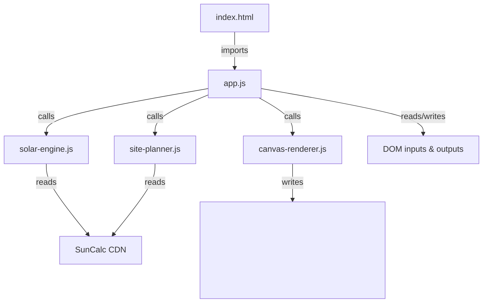

# Design Document: Passive Solar Planner

## Overview

The Passive Solar Planner transforms a minimal SunCalc scaffold into a full passive solar analysis tool for residential and permaculture site planning. All computation runs in the browser with no server or build pipeline. The application delivers eight feature areas: coordinate input with validation, passive solar gain calculation, overhang sizing, sun arc visualisation, tree placement recommendations, seasonal sunlight duration, results export, and a responsive Tailwind CSS layout.

The design follows a module-per-concern pattern using plain ES module `<script type="module">` tags loaded in `index.html`. No bundler, no transpiler. Each module is a plain `.js` file that exports pure functions, making the logic easy to test in isolation. The canvas-based visualisation is handled by a dedicated module that reads the pure-function outputs and renders to a `<canvas>` element.

**Key research findings:**
- `SunCalc.getPosition(date, lat, lng)` returns `{ altitude, azimuth }` in **radians**. `altitude` is measured from the horizon (positive = above). `azimuth` is measured from **south**, increasing westward — it must be converted to a north-clockwise bearing for display: `bearing = (azimuth * 180/π) + 180`.
- `SunCalc.getTimes(date, lat, lng)` returns an object whose `sunrise` and `sunset` properties are `Date` objects, or `NaN` during polar day/night conditions. The `solarNoon` property gives the transit time.
- Tailwind CSS Play CDN (`https://cdn.tailwindcss.com`) compiles classes at runtime in the browser — no build step required. The CDN script tag must appear in `<head>`.
- The existing `style.css` will be replaced by Tailwind utility classes; the file can be removed or emptied.

---

## Architecture

The application is split into four JavaScript modules plus the HTML entry point:

```
index.html          — Entry point; CDN script tags; module imports; <noscript> fallback
solar-engine.js     — Pure functions: validation, solar gain, overhang, sunlight duration
site-planner.js     — Pure functions: arc data generation, shadow zones, tree placement
canvas-renderer.js  — Canvas drawing: arcs, planting zones, labels, scale bar, tooltips
app.js              — UI glue: reads DOM inputs, calls engine/planner, updates DOM, export
```

The separation between pure computation and DOM manipulation means every function in `solar-engine.js` and `site-planner.js` can be tested with a JavaScript property-based testing library (fast-check) without a browser context.



**Data flow for a full analysis:**
1. User fills inputs → `app.js` reads values and calls `validateCoordinates()` from `solar-engine.js`.
2. On success, `app.js` calls all engine functions and collects results into a single `AnalysisResult` object.
3. `app.js` calls `site-planner.js` to build arc data and planting-zone geometry.
4. `app.js` calls `canvas-renderer.js` to draw everything to the canvas.
5. `app.js` writes computed text values into DOM output elements.
6. Export functions in `app.js` use `canvas.toDataURL()` and a generated text string.

---

## Components and Interfaces

### solar-engine.js

All functions are pure (no side-effects, no DOM access).

```js
/**
 * Validate geographic coordinates.
 * @param {number} lat  − Decimal degrees, must be in [−90, +90]
 * @param {number} lng  − Decimal degrees, must be in [−180, +180]
 * @returns {{ valid: boolean, errors: string[] }}
 */
export function validateCoordinates(lat, lng) { ... }

/**
 * Determine optimal solar orientation (azimuth in degrees, north-clockwise).
 * Northern Hemisphere → 180° (south-facing).
 * Southern Hemisphere → 0° (north-facing).
 * @param {number} lat
 * @returns {number}  optimalAzimuth  (0 or 180)
 */
export function getOptimalAzimuth(lat) { ... }

/**
 * Compute Winter Solstice solar noon altitude at the given latitude.
 * Uses SunCalc.getPosition at 12:00 UTC on the appropriate December/June solstice.
 * @param {number} lat
 * @param {number} lng
 * @returns {number}  altitudeDeg  (degrees above horizon, ≥ 0)
 */
export function getWinterSolsticeAltitude(lat, lng) { ... }

/**
 * Compute Summer Solstice solar noon altitude (approximation: lat ± 23.5°, capped).
 * @param {number} lat
 * @returns {number}  altitudeDeg
 */
export function getSummerAltitudeApprox(lat) { ... }

/**
 * Compute Winter Solstice solar noon altitude (approximation: lat ∓ 23.5°, floored at 0).
 * @param {number} lat
 * @returns {number}  altitudeDeg
 */
export function getWinterAltitudeApprox(lat) { ... }

/**
 * Calculate passive solar gain.
 * @param {number} windowArea   m² or ft² (unit-agnostic ratio)
 * @param {number} altitudeDeg  Winter solstice solar altitude in degrees
 * @returns {number}  gain  (same unit as windowArea)
 */
export function calcPassiveSolarGain(windowArea, altitudeDeg) { ... }

/**
 * Calculate relative gain ratio vs theoretical maximum (orientation = 0° deviation).
 * @param {number} orientationDeg  Deviation from optimal azimuth, degrees
 * @param {number} altitudeDeg     Winter solstice altitude
 * @returns {number}  ratio  0–100 (percentage)
 */
export function calcRelativeGainRatio(orientationDeg, altitudeDeg) { ... }

/**
 * Calculate minimum overhang depth (full summer shading).
 * Returns null if summerAltitudeDeg ≤ 0 (polar condition).
 * @param {number} windowHeight     metres or feet
 * @param {number} summerAltitudeDeg
 * @returns {number|null}  depth
 */
export function calcOverhangMin(windowHeight, summerAltitudeDeg) { ... }

/**
 * Calculate maximum overhang depth (full winter sun at sill).
 * Returns null if winterAltitudeDeg ≤ 0 (polar night / equatorial condition).
 * @param {number} windowHeight
 * @param {number} winterAltitudeDeg
 * @returns {number|null}  depthMax
 */
export function calcOverhangMax(windowHeight, winterAltitudeDeg) { ... }

/**
 * Convert a distance value between metric and imperial.
 * @param {number}  value
 * @param {'metric'|'imperial'} from
 * @param {'metric'|'imperial'} to
 * @returns {number}
 */
export function convertDistance(value, from, to) { ... }

/**
 * Compute sunlight duration for a solstice at the given location.
 * Returns { hours, minutes, isPolarDay, isPolarNight } 
 * isPolarDay / isPolarNight are true when SunCalc returns NaN for sunrise/sunset.
 * @param {number} lat
 * @param {number} lng
 * @param {'summer'|'winter'} solstice
 * @returns {{ durationMs: number|null, isPolarDay: boolean, isPolarNight: boolean }}
 */
export function getSunlightDuration(lat, lng, solstice) { ... }

/**
 * Check whether a latitude is within a polar circle.
 * @param {number} lat
 * @returns {boolean}
 */
export function isPolarLatitude(lat) { ... }
```

### site-planner.js

```js
/**
 * Generate arc point data for one solstice day.
 * Samples SunCalc.getPosition every 30 minutes between sunrise and sunset.
 * @param {number} lat
 * @param {number} lng
 * @param {'summer'|'winter'} solstice
 * @returns {ArcPoint[]}  Array of { time: Date, altitudeDeg, azimuthDeg, label?: string }
 */
export function buildArcData(lat, lng, solstice) { ... }

/**
 * Compute shadow length cast by an object of given height at a given solar altitude.
 * Returns Infinity when altitudeDeg ≤ 0 (sun below horizon).
 * @param {number} objectHeight   metres or feet
 * @param {number} altitudeDeg
 * @returns {number}  shadowLength  (same units as objectHeight)
 */
export function calcShadowLength(objectHeight, altitudeDeg) { ... }

/**
 * Compute deciduous and evergreen planting zone geometries relative to building centre.
 * Returns objects describing arc sectors (angle range, radius) in canvas-space.
 * @param {number} lat
 * @param {number} summerShadowLength   metres or feet
 * @param {number} winterShadowLength   metres or feet
 * @returns {{ deciduous: ZoneGeometry, evergreen: ZoneGeometry }}
 */
export function calcPlantingZones(lat, summerShadowLength, winterShadowLength) { ... }

/**
 * @typedef {Object} ArcPoint
 * @property {Date}   time
 * @property {number} altitudeDeg
 * @property {number} azimuthDeg   North-clockwise, 0–360
 * @property {string} [label]      'sunrise' | 'noon' | 'sunset'
 */

/**
 * @typedef {Object} ZoneGeometry
 * @property {number} startAngleDeg   North-clockwise start of arc sector
 * @property {number} endAngleDeg     North-clockwise end of arc sector
 * @property {number} radius          Shadow reach distance
 * @property {string} type            'deciduous' | 'evergreen'
 */
```

### canvas-renderer.js

```js
/**
 * Draw the full site analysis visualisation onto a canvas element.
 * @param {HTMLCanvasElement} canvas
 * @param {ArcPoint[]}        summerArc
 * @param {ArcPoint[]}        winterArc
 * @param {ZoneGeometry}      deciduousZone
 * @param {ZoneGeometry}      evergreenZone
 * @param {{ unit: 'metric'|'imperial', metersPerPixel: number }} options
 */
export function renderAll(canvas, summerArc, winterArc, deciduousZone, evergreenZone, options) { ... }

/** Clear canvas and reset state. */
export function clearCanvas(canvas) { ... }

/**
 * Return the ArcPoint nearest to a canvas pixel coordinate, or null if none within threshold.
 * @param {number} canvasX
 * @param {number} canvasY
 * @param {ArcPoint[]} points
 * @param {number} thresholdPx
 * @returns {ArcPoint|null}
 */
export function hitTestArcPoint(canvasX, canvasY, points, thresholdPx) { ... }
```

### app.js

Wires DOM events to the engine/planner functions. Not tested with property-based tests directly (DOM-coupled), but covered by example-based integration tests.

Key responsibilities:
- Read and validate form inputs on submit.
- Invoke geolocation API; handle errors gracefully.
- Orchestrate calls to `solar-engine.js`, `site-planner.js`, `canvas-renderer.js`.
- Populate result DOM elements.
- Handle unit toggle (re-run calculations, update labels).
- Attach canvas `mousemove` listener for tooltip.
- Handle PNG and `.txt` export.
- Enable/disable export buttons based on analysis state.

---

## Data Models

### AnalysisResult

```js
/**
 * @typedef {Object} AnalysisResult
 * @property {number}  lat
 * @property {number}  lng
 * @property {'metric'|'imperial'} unit
 * @property {number}  optimalAzimuth          0 or 180 degrees
 * @property {number}  winterAltitudeDeg
 * @property {number}  summerAltitudeDeg
 * @property {number}  passiveSolarGain
 * @property {number}  relativeGainRatio       0–100
 * @property {number|null} overhangMin         null if polar
 * @property {number|null} overhangMax         null if polar or winter alt ≤ 0
 * @property {SunlightDuration} summerDuration
 * @property {SunlightDuration} winterDuration
 * @property {ArcPoint[]} summerArc
 * @property {ArcPoint[]} winterArc
 * @property {ZoneGeometry} deciduousZone
 * @property {ZoneGeometry} evergreenZone
 * @property {boolean}  analysisComplete
 */

/**
 * @typedef {Object} SunlightDuration
 * @property {number|null} durationMs
 * @property {boolean}     isPolarDay
 * @property {boolean}     isPolarNight
 */
```

### FormInputs (read from DOM)

| Field | Type | Validation |
|---|---|---|
| `lat` | `number` | `[−90, +90]` |
| `lng` | `number` | `[−180, +180]` |
| `windowArea` | `number` | `> 0` |
| `windowHeight` | `number` | `> 0` |
| `orientationAngle` | `number` | `[0, 360)` |
| `treeHeight` | `number` | `> 0`, default 6 m / 20 ft |
| `unit` | `'metric'|'imperial'` | one of two values |

### Canvas Coordinate System

- Canvas origin (0,0) at top-left.
- Property centre mapped to canvas centre `(cx, cy)`.
- North is at the top (canvas y decreasing = moving north).
- An azimuth bearing θ (north-clockwise) maps to canvas angle `θ − 90°` in standard `ctx.arc()` convention.
- Conversion: `canvasX = cx + r × sin(θ_rad)`, `canvasY = cy − r × cos(θ_rad)`.

---

## Correctness Properties

*A property is a characteristic or behavior that should hold true across all valid executions of a system — essentially, a formal statement about what the system should do. Properties serve as the bridge between human-readable specifications and machine-verifiable correctness guarantees.*

**Property reflection:** After completing prework analysis, the following properties were reviewed for redundancy:
- Properties 3.1 and 3.2 (summer/winter altitude approximations) are logically independent (different formulas, different caps) and are kept separate.
- Properties 2.2 and 2.3 (gain and ratio) both test the gain formula family but measure different outputs; kept separate.
- Properties 5.2 and 5.3 (deciduous/evergreen hemisphere placement) can be consolidated into a single hemisphere-placement property since they follow the same hemisphere-switch logic — consolidated into Property 9.
- Property 6.1 (sunrise < noon < sunset ordering) and Property 6.2 (duration = sunset − sunrise) are complementary; both kept.
- Properties 2.5 (optimal azimuth hemisphere switch) is a special case of Property 9 — merged.

### Property 1: Out-of-range coordinates are always rejected

*For any* latitude outside [−90, +90] or longitude outside [−180, +180], `validateCoordinates` SHALL return `valid: false` and a non-empty `errors` array, and the calculation SHALL not proceed.

**Validates: Requirements 1.2**

---

### Property 2: Unit conversion is reversible

*For any* positive distance value, converting from metric to imperial and back to metric SHALL yield the original value (within floating-point tolerance of ±0.001).

**Validates: Requirements 1.5**

---

### Property 3: All distance outputs respect the selected unit

*For any* valid site inputs run in metric mode, all computed distance outputs (overhang depths, shadow lengths) are in metres; the same inputs run in imperial mode yield outputs scaled by the conversion factor 3.28084, within ±0.001 relative error.

**Validates: Requirements 1.5**

---

### Property 4: Passive solar gain equals the formula

*For any* positive window area `A` and winter solstice altitude angle θ in degrees, `calcPassiveSolarGain(A, θ)` SHALL equal `A × cos(θ × π / 180)` within ±1e-10.

**Validates: Requirements 2.2**

---

### Property 5: Relative gain ratio is bounded and maximised at zero deviation

*For any* orientation deviation δ, `calcRelativeGainRatio(δ, θ)` SHALL return a value in [0, 100]; and at δ = 0 the ratio SHALL equal 100.

**Validates: Requirements 2.3**

---

### Property 6: Orientation warning fires exactly when deviation exceeds 30°

*For any* orientation angle, the warning flag returned by the gain calculator SHALL be `true` if and only if `|deviation_from_optimal| > 30`.

**Validates: Requirements 2.4**

---

### Property 7: Summer altitude approximation is capped at 90°

*For any* latitude φ, `getSummerAltitudeApprox(φ)` SHALL equal `min(φ + 23.5, 90)` (for Northern Hemisphere convention; the Southern Hemisphere applies the mirror formula), and SHALL never exceed 90.

**Validates: Requirements 3.1**

---

### Property 8: Winter altitude approximation is floored at 0°

*For any* latitude φ, `getWinterAltitudeApprox(φ)` SHALL equal `max(φ − 23.5, 0)` (Northern Hemisphere convention), and SHALL never be negative.

**Validates: Requirements 3.2**

---

### Property 9: Overhang depth equals the formula

*For any* positive window height `h` and solar altitude angle α > 0°, `calcOverhangMin(h, α)` SHALL equal `h / tan(α × π / 180)` within ±1e-10, and `calcOverhangMax` SHALL follow the same formula with the winter altitude.

**Validates: Requirements 3.3, 3.4**

---

### Property 10: Hemisphere determines optimal orientation and planting zones

*For any* latitude φ ≠ 0:
- When φ > 0 (Northern Hemisphere): optimal azimuth SHALL be 180°, deciduous zone SHALL be on the south/west quadrants, evergreen zone SHALL be on the north/northwest quadrants.
- When φ < 0 (Southern Hemisphere): optimal azimuth SHALL be 0°, deciduous zone SHALL be on the north/west quadrants, evergreen zone SHALL be on the south/southwest quadrants.

**Validates: Requirements 2.5, 5.2, 5.3**

---

### Property 11: Sun arc points are ordered and within daylight bounds

*For any* valid non-polar coordinates, `buildArcData` SHALL return an array where every consecutive pair of points is exactly 30 minutes apart, every point's `time` is ≥ sunrise and ≤ sunset, and points are in ascending time order.

**Validates: Requirements 4.1**

---

### Property 12: Shadow length equals the formula

*For any* positive object height `h` and solar altitude α > 0°, `calcShadowLength(h, α)` SHALL equal `h / tan(α × π / 180)` within ±1e-10.

**Validates: Requirements 5.1**

---

### Property 13: Sunrise precedes solar noon precedes sunset (non-polar)

*For any* valid coordinates with `|lat| < 66.5°`, `getSunlightDuration` SHALL return times satisfying `sunrise < solarNoon < sunset` for both solstices.

**Validates: Requirements 6.1**

---

### Property 14: Sunlight duration equals sunset minus sunrise

*For any* valid sunrise and sunset Date pair (sunrise < sunset), `getSunlightDuration` SHALL return `durationMs = sunset.getTime() − sunrise.getTime()`, within ±1 ms.

**Validates: Requirements 6.2**

---

### Property 15: Polar latitude detection is correct

*For any* latitude with `|lat| ≥ 66.5°`, `isPolarLatitude(lat)` SHALL return `true`; for `|lat| < 66.5°` it SHALL return `false`.

**Validates: Requirements 6.4**

---

### Property 16: Text export contains all required fields

*For any* valid `AnalysisResult` object, `generateTextExport(result)` SHALL produce a string that contains all of the following substrings: the passive solar gain value, the overhang depth range, the summer sunlight duration, the winter sunlight duration, and at least one tree placement recommendation.

**Validates: Requirements 7.2**

---

## Error Handling

| Error scenario | Handling |
|---|---|
| Coordinates out of range | `validateCoordinates` returns `errors[]`; `app.js` renders each error below the relevant input field; calculation is blocked |
| Geolocation permission denied (code 1) | Display: "Location access was denied. Please enter coordinates manually." |
| Geolocation position unavailable (code 2) | Display: "Location could not be determined. Please enter coordinates manually." |
| Geolocation timeout (code 3) | Display: "Location request timed out. Please enter coordinates manually." |
| Polar day (SunCalc `sunrise` is `NaN`) | `getSunlightDuration` sets `isPolarDay: true`; UI shows "Polar day — sun does not set on this date." |
| Polar night (SunCalc `sunset` is `NaN`) | `getSunlightDuration` sets `isPolarNight: true`; UI shows "Polar night — sun does not rise on this date." |
| Summer altitude ≤ 0° (overhang N/A) | `calcOverhangMin` returns `null`; UI shows "Overhang calculation not applicable at this latitude." |
| Winter altitude = 0° (overhang max undefined) | `calcOverhangMax` returns `null`; UI omits the max depth line |
| Export before analysis | Export buttons carry `disabled` attribute; tooltip explains action required |
| Non-numeric form inputs | HTML5 `type="number"` prevents non-numeric entry; `parseFloat` guards in `app.js` add fallback validation |
| JavaScript disabled | `<noscript>` block in `index.html` displays: "JavaScript is required for Passive Solar Planner to work." |

---

## Testing Strategy

### Overview

Testing is split into two complementary layers:

1. **Property-based tests** (fast-check) verify universal invariants of the pure-function modules (`solar-engine.js`, `site-planner.js`). Each test runs a minimum of 100 randomly generated inputs.
2. **Example-based unit tests** (Jest or Vitest) verify specific scenarios, UI state transitions, edge cases, and the canvas-renderer integration.

Because all business logic is in pure-function modules with no DOM dependency, tests can run in Node.js via Jest/Vitest without a browser.

### Property-based Testing (fast-check)

Library: [fast-check](https://fast-check.io/) — mature, well-maintained, TypeScript-friendly, runs in Node.js.

Each property test is tagged with a comment referencing the design property it validates:

```js
// Feature: passive-solar-planner, Property 4: Passive solar gain equals the formula
test('gain = area * cos(theta)', () => {
  fc.assert(
    fc.property(
      fc.float({ min: 0.01, max: 10000 }),  // windowArea
      fc.float({ min: 0, max: 89.9 }),       // altitudeDeg
      (area, alt) => {
        const result = calcPassiveSolarGain(area, alt);
        return Math.abs(result - area * Math.cos(alt * Math.PI / 180)) < 1e-10;
      }
    ),
    { numRuns: 200 }
  );
});
```

**Properties to implement as tests:**

| Test | Property | Module |
|---|---|---|
| Coordinate validation rejects all OOB values | Property 1 | solar-engine |
| Unit conversion round-trip | Property 2 | solar-engine |
| All outputs respect selected unit | Property 3 | solar-engine |
| Gain formula exact | Property 4 | solar-engine |
| Ratio bounded, maximum at zero deviation | Property 5 | solar-engine |
| Warning fires iff deviation > 30° | Property 6 | solar-engine |
| Summer altitude cap at 90° | Property 7 | solar-engine |
| Winter altitude floor at 0° | Property 8 | solar-engine |
| Overhang depth formula | Property 9 | solar-engine |
| Hemisphere determines orientation and zones | Property 10 | solar-engine + site-planner |
| Arc points ordered, 30-min intervals, within daylight | Property 11 | site-planner |
| Shadow length formula | Property 12 | site-planner |
| Sunrise < noon < sunset | Property 13 | solar-engine |
| Duration = sunset − sunrise | Property 14 | solar-engine |
| Polar detection threshold | Property 15 | solar-engine |
| Text export completeness | Property 16 | app (text generation function) |

**Minimum 100 iterations** per property test (`numRuns: 200` recommended for boundary-sensitive properties).

### Example-based Tests

- Input fields present with correct HTML attributes (Req 1.1)
- Geolocation success populates fields (Req 1.3)
- Geolocation error codes produce correct messages (Req 1.4)
- Gain/ratio/recommendation displayed after analysis (Req 2.6)
- Overhang range displayed in correct unit (Req 3.6)
- Canvas is non-blank after arc generation (Req 4.2)
- Arc data contains sunrise/noon/sunset labels (Req 4.3)
- Tooltip content on hover (Req 4.4)
- Legend element present (Req 5.5)
- Tree height change triggers recomputation (Req 5.6)
- Duration values displayed after analysis (Req 6.3)
- PNG export triggers `toDataURL` (Req 7.1)
- Download buttons exist in DOM (Req 7.3)
- Export buttons disabled before analysis, enabled after (Req 7.4)
- `<noscript>` element present (Req 8.5)

### Edge Cases

- Polar altitude ≤ 0° (overhang N/A) — Req 3.5
- Geolocation error codes 1, 2, 3 — Req 1.4
- JavaScript disabled `<noscript>` — Req 8.5

### Smoke Checks

- Tailwind CDN `<script>` tag present in `index.html` (Req 8.1)
- All `<script>` / `<link>` tags reference CDN URLs, no local server paths (Req 8.4)

### Responsive Layout

Manual verification at 320 px, 768 px, 1280 px, and 2560 px viewport widths using browser DevTools. No horizontal overflow; all interactive elements reachable.
